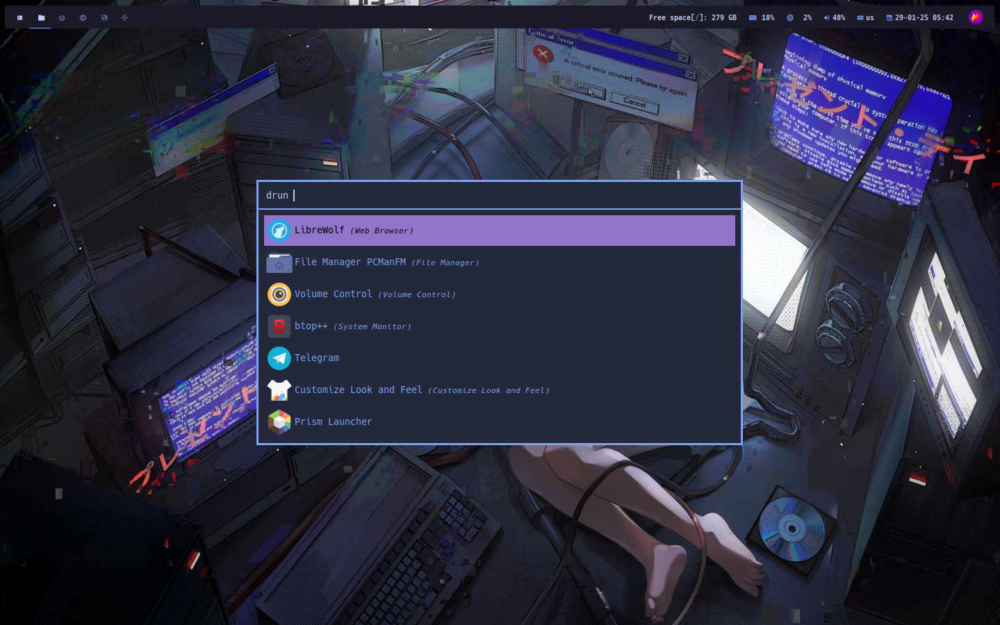

# 🖼️ dotfiles-bspwm

## ✍🏻 Description
My Serial Experiments Lain themed BSPWM rice with TokyoNight Theme

## 🚚 Dependencies

### Required

- `bspwm`
- `sxhkd`
- `polybar`
- `gtk3`
- `gtk4`
-  [TokyoNight gtk3/4 theme](https://aur.archlinux.org/packages/tokyonight-gtk-theme-git)
-  [Dracula icons](https://aur.archlinux.org/packages/dracula-icons-git)
-  [Cursor theme](https://aur.archlinux.org/packages/xcursor-simp1e-tokyo-night)

### Optional

**📝NOTE: you can use something different, but you need to setting and set theme yourself.**

- `rofi` - application launcher, I use custom theme for it
- `alacritty` - terminal emulator, I use custom theme for it
- `fastfetch` - fetch, I use custom config for it
- `btop` - resource monitor
- `mpd & ncmpcpp` - media player daemon and music player
- `zsh` - shell
- [Zap-zsh](https://www.zapzsh.com/) - zsh plugin manager


## 🚧 Installation
1. Install all dependencies using your package manager
2. Clone repo
```bash
git clone https://github.com/qstargest/dotfiles-bspwm
```
3. Copy .config folder, .xinitrc, .zshrc, .p10k.zsh, and wall8.png to your home directory
### ✨ Enjoy!

## 🔗 Special thanks
- [I used groups fastfetch preset from this repo, changed it for my needs](https://github.com/LierB/fastfetch)
- [I used this rofi theme and made some minor changes](https://github.com/w8ste/Tokyonight-rofi-theme)
